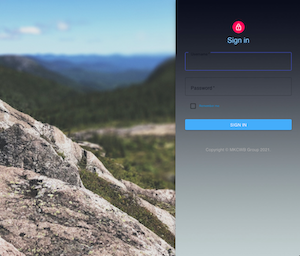
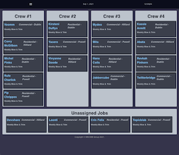
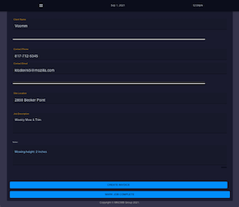
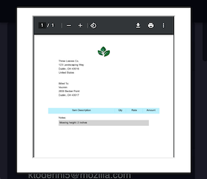

# Custom Workforce Manager

## Progressive Web Application (Mobile/Tablet First)

## Table of Contents

- [User Story](#user-story)
- [Tech](#tech)
- [Visuals](#visuals)
- [Links](#links)
- [Installation](#installation)
- [Future Development](#future-development)
- [Contribute](#contribute)
- [Contact Me](#questions)
- [License](#license)

### User Story

    AS AN ADMINISTRATOR
    I WANT to be able to
    - create invoices, that employees can easily fill out
    - receive job information and create jobs
    - assign jobs to employees
    - monitor employee Job progress
    SO THAT I can efficently operate and manage my small / medium sized business's fleet employees.

    AS AN EMPLOYEE
    I WANT to be able to
    - view assigned jobs for the day
    - access jobsite information (i.e. address, contact information, notes, etc)
    - complete related jobsite forms/invoices
    - mark jobs completed
    - have the ability to continue to work while remote and offline
    SO THAT I can continue to complete my job expectations in an easy and organized fashion.

### Tech

- MongoDb
- Express
- React (w/ hooks)
- Node.Js
- Passport.Js
- Sortable Js
- Moment
- react-material-ui

### Visuals

 
 

### Links

- Deployed Application: Personal Version - <https://tranquil-forest-68396.herokuapp.com/>
- Deployed Application: Original - <https://custom-workforce-manager.herokuapp.com/>

### Installation

This program can be run through a browser using the above link to the the deployed application. Alternatively, to run this application locally you will need to:

Clone this repository to receive all of the files
Set up your environment variables in a .env file
Run "npm install" in the command line of your terminal to set up all of the dependencies
Populate the existing database items by running "npm run seed" in your terminal
Run "npm start" to start the application's connection
Go to the url of the application (http//:localhost:3000) to begin using it

#### Login Information

- Admin Username: Crew #1 | Password: 4CfkVBoxV
- Employee Username: Crew #2 | Password: Ggjz4t1

### Future Development

#### PWA Functionalities (in progress)

- Available offline
- Downloadable to android + ios homescreen's
- Device camera functionality / implementation
- Fast load speeds
- Mobile app look/feel
- Push Notifications (mobile + desktop)

### Contribute

Creators:

- Michael Kotte: <https://github.com/mkotte>
- Kathryn Wilkinson: <https://github.com/NAHco-code>
- William Nicholson: <https://github.com/will98nicholson>
- Brandon King: <https://github.com/thebsking>
- Corrinne Worden: <https://github.com/CorrinneW>

If you have something you'd like to contribute, make a pull request!

## Questions?

Please feel free to contact us with any questions via email.

- [michaelkotte1@gmail.com](michaelkotte1@gmail.com)
- [kathrynxwilk@gmail.com](kathrynxwilk@gmail.com)
- [will98nicholson@gmail.com](will98nicholson@gmail.com)
- [brandonscottking@gmail.com](brandonscottking@gmail.com)
- [corrinneworden@gmail.com](corrinneworden@gmail.com)

## License

This project is licensed under the Apache 2.0 License.
For more information, please visit: [Apache Explained](https://choosealicense.com/licenses/apache-2.0/)

&copy; 2021 k.wilkinson | m.kotte | w.nicholson | b.king | c.worden
